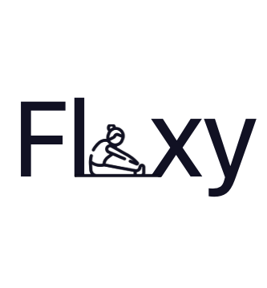

# TheLight
<!-- PROJECT LOGO -->

<h3>   Flexy   
</h3>   
  
   

# Overveiw
Flexy is an inclusive IOS app that gives the user the encourage the users to exercise daily by giving them the ability to schedule morning and evening notifications time based on their preference to have 1 min stretching and flexibility exercise. The exercises are randomly generated each time the app is used. Flexy supports vision disability by supporting voice over and reduce motion features. It also supports both English and Arabic language. 
### Big Idea
Inclusion.

# Challenge Statement
Make an inclusive solution that help a busy people.

# Solution Concept
A Reminder for Busy people who want to exercise daily so that they enhance their lifestyle.

 # Technologies & Tools
[![SwiftUI][SwiftUI-img]][SwiftUI-url]   [![Sketch][Sketch-img]][Sketch-url]   [![GitHub][GitHub-img]][GitHub-url]

# Demo of your App
<a href="https://drive.google.com/file/d/1voRDPYBD59nTCgkxK2VCdDymXtrjr1hE/view?usp=share_link">Demo</a>     </h3>   
  
   

# Challenge Summary

# Team
 #### The light
 <a href="https://www.linkedin.com/in/khulood-alhamed-73a837209/">Khulood Alhamed</a> Omnya Kamal<a href="https://www.linkedin.com/in/omnyakamal/">
 
<!-- MARKDOWN LINKS & IMAGES -->
<!-- https://www.markdownguide.org/basic-syntax/#reference-style-links -->
[SwiftUI-img]: https://img.shields.io/badge/-SwiftUI-blue
[SwiftUI-url]: https://developer.apple.com/xcode/swiftui/
[Sketch-img]: https://img.shields.io/badge/-Sketch-yellow
[Sketch-url]: https://www.sketch.com
[GitHub-img]: https://img.shields.io/badge/-GitHub-lightgrey
[GitHub-url]: https://github.com/Khulood00/TheLight

